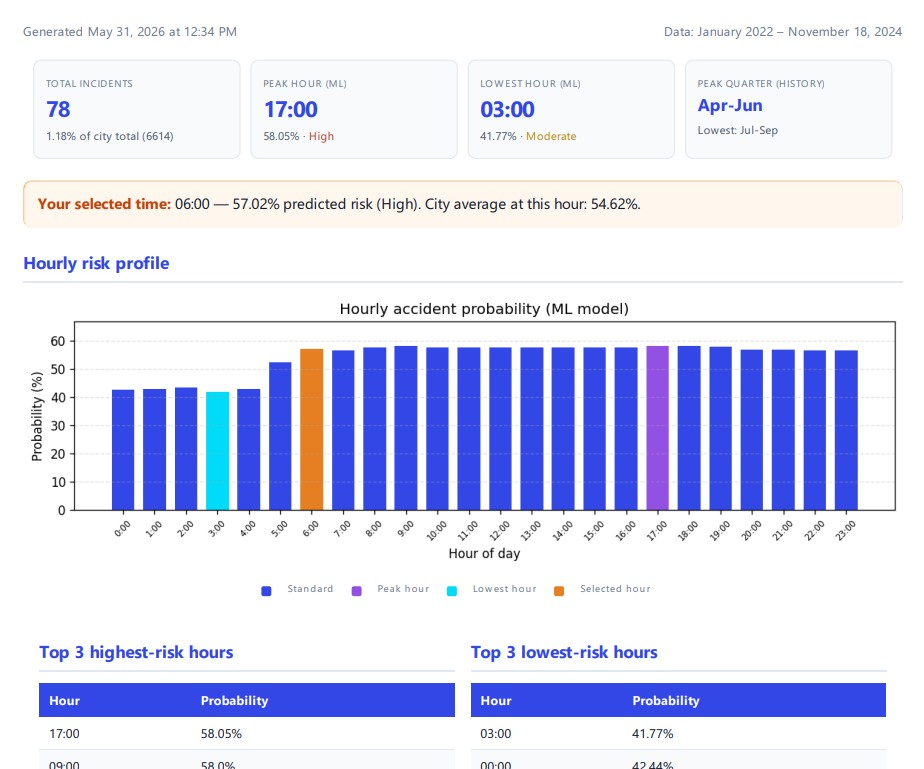
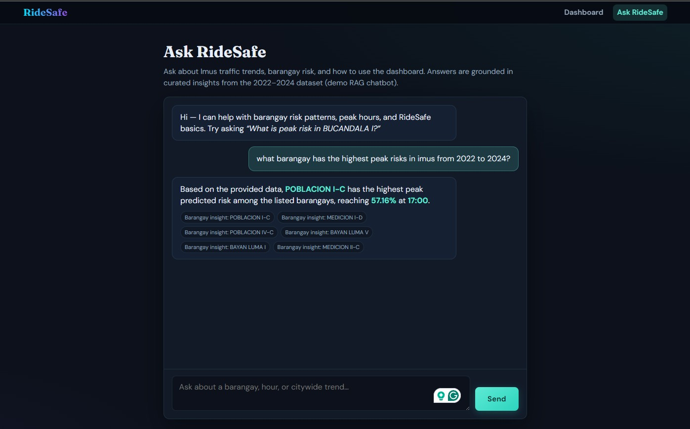

# RideSafe - Traffic Accident Analysis & Prediction System

<div align="center">

**A web application for analyzing traffic accidents and predicting accident risk in Imus, Philippines**

[Features](#features) • [Setup](#setup) • [Architecture](#architecture) • [Usage](#usage)

</div>

---

## Overview

RideSafe is a traffic safety platform that uses historical incident data (2022–2024) and machine learning to help analyze accident patterns in Imus City. Users can explore interactive dashboards and heatmaps, run barangay-level risk predictions, download PDF summary reports, and ask questions via an optional RAG chatbot grounded in curated insights.

## Screenshots

<div align="center">
  
  
  
  
   
</div>

## Features

**Key capabilities:**

- **Accident prediction**: ML-powered risk assessment by barangay and hour of day using a Random Forest classifier
- **Interactive dashboards**: Dynamic bar graphs, heatmaps, and time-series charts built with Plotly and Folium
- **PDF reports**: Multi-section barangay summary (KPIs, hourly chart, historical breakdown, ML recommendations) — run a prediction first, then download
- **Geospatial analysis**: Accident density mapping using GeoJSON data of Imus barangays
- **Ask RideSafe**: RAG chatbot (`/chat`) — insight text from analytics tables, Gemini embeddings + answers, stored in Postgres with pgvector
- **Production-ready**: Postgres-backed data layer, startup caching, health checks, and rate limiting

## Tech Stack

- **Backend**: Flask (Python 3.12+)
- **Database**: PostgreSQL + pgvector (production / Docker) / SQLite (local fallback; dashboard only)
- **Machine learning**: Scikit-learn (Random Forest + SMOTE)
- **LLM / RAG**: Google Gemini (`gemini-embedding-001`, flash chat) via `GOOGLE_API_KEY`
- **Frontend**: HTML5, CSS3, JavaScript, Plotly.js
- **Mapping**: Folium, GeoPandas
- **Report generation**: pdfkit (wkhtmltopdf), Jinja2

## Setup Instructions

### Prerequisites

- **Python 3.12+**
- **traffic-incident.xlsx** in the project root (used once to seed the database)
- **wkhtmltopdf** (required for PDF generation locally; included in Docker image)
  - Windows: Download from [wkhtmltopdf.org](https://wkhtmltopdf.org/downloads.html)
  - macOS: `brew install wkhtmltopdf`
  - Linux: `apt-get install wkhtmltopdf`
  - Optional: set `WKHTMLTOPDF_PATH` if the binary is not on PATH

### Local development (SQLite)

1. **Clone and install**

   ```bash
   git clone https://github.com/Mich-Tapawan/RideSafe.git
   cd RideSafe
   python -m venv venv
   venv\Scripts\activate   # Windows
   pip install -r requirements.txt
   ```

2. **Place** `traffic-incident.xlsx` in the project root.

3. **Seed the database** (creates `.data/ridesafe.db` if `DATABASE_URL` is not set)

   ```bash
   python -m scripts.seed_database
   ```

4. **Run the app**

   ```bash
   python app.py
   ```

5. **Open** `http://localhost:5000`

### Local development (Docker + Postgres)

1. Create a `.env` file in the project root (gitignored) with your Gemini API key:

   ```bash
   GOOGLE_API_KEY=your_key_here
   ```

2. Start Postgres (pgvector) + the app:

   ```bash
   docker compose up --build
   ```

Open `http://localhost:10000`. The web container seeds analytics, builds the RAG corpus (when `GOOGLE_API_KEY` is set), then starts Gunicorn.

Without `GOOGLE_API_KEY`, the dashboard still runs; `/chat` and `/api/chat` return a clear “not ready” / missing-key message.

### Production (Render)

Deploy with the included [`render.yaml`](render.yaml) Blueprint. It provisions:

- A **PostgreSQL** database (`ridesafe-db`) — enable/use the `vector` extension (created on app startup)
- A **Docker web service** with `DATABASE_URL` linked automatically
- Health checks on `/health`

Set **`GOOGLE_API_KEY`** in the Render dashboard (Blueprint marks it as a sync env var — you supply the value). Without it, the site boots but the chatbot corpus is skipped.

The Docker entrypoint runs:

```text
python -m scripts.seed_database && python -m scripts.build_rag_corpus && gunicorn ...
```

Both seed and corpus steps are idempotent (skip when already populated).

### Keeping the free tier awake

Render’s free web service sleeps after ~15 minutes of idle traffic. To reduce cold starts:

1. **GitHub Actions (included)** — [`.github/workflows/keep-alive.yml`](.github/workflows/keep-alive.yml) pings `/health` every 10 minutes.
   - After deploy, set a repository **variable** (or secret): `RENDER_URL` = `https://your-service.onrender.com` (no trailing slash).
   - Path: GitHub repo → **Settings** → **Secrets and variables** → **Actions** → **Variables** → New variable.
   - You can also run it manually under **Actions** → **Keep Render awake** → **Run workflow**.
2. **UptimeRobot (optional)** — Create an HTTP monitor on `https://your-service.onrender.com/health` every 5–10 minutes.

Always ping **`/health`**, not `/` (the homepage is expensive to generate).

## Environment variables

| Variable | Description | Default |
| -------- | ----------- | ------- |
| `DATABASE_URL` | Postgres connection string | SQLite at `.data/ridesafe.db` |
| `GOOGLE_API_KEY` | Gemini API key for embeddings + chat | unset (chat unavailable) |
| `GEMINI_EMBED_MODEL` | Embedding model name | `gemini-embedding-001` |
| `GEMINI_CHAT_MODEL` | Chat model name | `gemini-flash-latest` |
| `GEMINI_CHAT_FALLBACKS` | Comma-separated fallbacks on 429/503 | `gemini-flash-lite-latest,gemini-3.5-flash-lite,gemini-3.1-flash-lite` |
| `WKHTMLTOPDF_PATH` | Path to wkhtmltopdf binary | Auto-detected |
| `WEB_CONCURRENCY` | Gunicorn worker count | `1` |
| `LOG_LEVEL` | Python log level | `INFO` |
| `FLASK_DEBUG` | Enable Flask debug mode (`1` to enable) | off |
| `EXCEL_FILE_PATH` | Path to xlsx for seeding | `traffic-incident.xlsx` |

Do not commit API keys; keep `.env` gitignored.

## Data updates

Runtime reads from the database, not the xlsx file. To refresh data:

1. Update `traffic-incident.xlsx`
2. Force re-seed:

   ```bash
   python -m scripts.seed_database --force
   ```

3. Rebuild the RAG corpus (Postgres + `GOOGLE_API_KEY` required):

   ```bash
   python -m scripts.build_rag_corpus --force
   ```

   On Render, run the same commands via the shell, or redeploy after clearing the relevant tables.

## Architecture

On startup the app: initializes the DB (incl. `CREATE EXTENSION vector` on Postgres) → seeds from xlsx (if empty) → builds RAG corpus if empty → loads the ML model → precomputes city-wide hourly averages → warms the dashboard HTML cache.

The homepage and barangay list are served from in-memory cache. API endpoints query Postgres/SQLite. PDF reports combine DB incident history with ML predictions. Chat retrieves embedded insight chunks via pgvector cosine search, then answers with Gemini.

### Project structure

```
RideSafe/
├── app.py                        # Flask application & routes
├── traffic-incident.xlsx         # Source data for DB seeding
├── Dockerfile                    # Production image (wkhtmltopdf, GDAL, Gunicorn)
├── docker-compose.yml            # Local Postgres + web
├── render.yaml                   # Render Blueprint (web + Postgres)
├── requirements.txt
├── Procfile
│
├── scripts/
│   ├── db.py                     # SQLAlchemy models & session (incl. RAG tables)
│   ├── repository.py             # DB query helpers
│   ├── seed_database.py          # xlsx → DB import
│   ├── build_rag_corpus.py       # Insight docs + Gemini embeddings → pgvector
│   ├── rag.py                    # Embed, retrieve, answer
│   ├── cache.py                  # Dashboard warmup cache
│   ├── model.py                  # Random Forest prediction model
│   ├── bar_graph.py              # Plotly trend charts
│   ├── heat_map.py               # Folium geographic visualization
│   ├── chart.py                  # Time-series charts
│   ├── barangay_list.py          # Barangay list from DB
│   ├── month_data.py             # Monthly statistics
│   └── summary_report.py         # PDF report data assembly
│
├── templates/
│   ├── index.html
│   ├── chat.html
│   └── pdf_template.html
│
└── static/
    ├── assets/
    ├── js/                       # index.js, chat.js
    └── style/
```

## API Endpoints

| Endpoint                       | Method | Description                                                       |
| ------------------------------ | ------ | ----------------------------------------------------------------- |
| `/health`                      | GET    | Health check (`{"status": "ok"}`)                               |
| `/`                            | GET    | Main dashboard with visualizations (cached)                       |
| `/chat`                        | GET    | Ask RideSafe chatbot page                                         |
| `/api/chat`                    | POST   | RAG answer (`{"message": "..."}` → `answer`, `sources`)         |
| `/getMonthData`                | POST   | Monthly accident statistics (`year`, `month`)                     |
| `/predict`                     | POST   | ML accident probability (`barangay`, `hour`)                      |
| `/getBarangayList`             | GET    | List of barangays from incident data                              |
| `/getSummaryReport/<barangay>` | GET    | PDF summary report (`?hour=8` optional, highlights selected hour) |

Rate limits: `/` — 30/min, `/getSummaryReport` and `/api/chat` — 10/min.

## Machine Learning Model

The prediction model uses:

- **Algorithm**: Random Forest Classifier
- **Features**: Barangay, hour of day, peak hour indicator
- **Data balance**: SMOTE (Synthetic Minority Over-sampling Technique)
- **Training data**: Traffic incidents from 2022–2024
- **Artifacts**: `scripts/accident_prediction_model.pkl`, `scripts/barangay_encoder.pkl`

Retrain offline with `AccidentModel.train_and_save_model()` and redeploy the pickle files.

## License

This project is licensed under the MIT License — see the LICENSE file for details.

## Acknowledgments

- Traffic accident data from Imus City
- Built with Flask and Scikit-learn
- Interactive visualizations powered by Plotly and Folium
