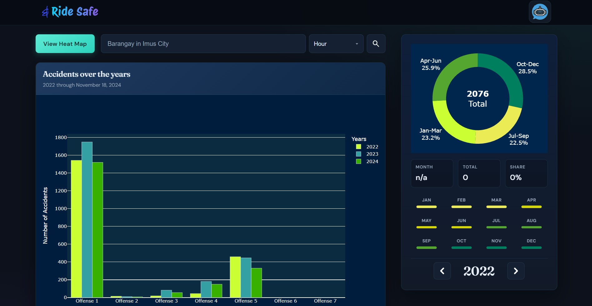
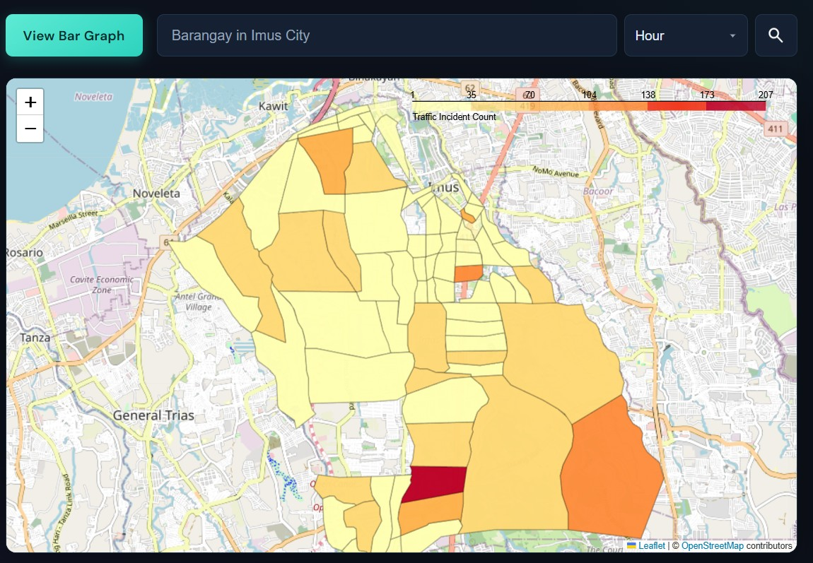
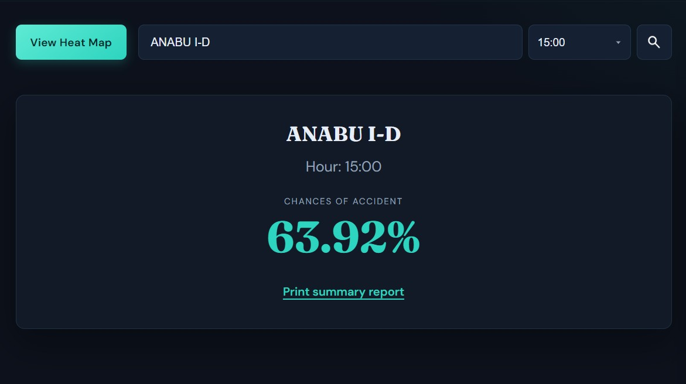

# RideSafe - Traffic Accident Analysis & Prediction System

<div align="center">

**A web application for analyzing traffic accidents and predicting accident risk in Imus, Philippines**

[Features](#features) • [Setup](#setup) • [Architecture](#architecture) • [Usage](#usage)

</div>

---

## Overview

RideSafe is a traffic safety platform that uses historical incident data (2022–2024) and machine learning to help analyze accident patterns in Imus City. Users can explore interactive dashboards and heatmaps, run barangay-level risk predictions, and download PDF summary reports.

## Screenshots

<div align="center">
  
  
  
</div>

## Features

**Key capabilities:**

- **Accident prediction**: ML-powered risk assessment by barangay and hour of day using a Random Forest classifier
- **Interactive dashboards**: Dynamic bar graphs, heatmaps, and time-series charts built with Plotly and Folium
- **PDF reports**: Multi-section barangay summary (KPIs, hourly chart, historical breakdown, ML recommendations) — run a prediction first, then download
- **Geospatial analysis**: Accident density mapping using GeoJSON data of Imus barangays

## Tech Stack

- **Backend**: Flask (Python 3.8+)
- **Machine learning**: Scikit-learn (Random Forest + SMOTE)
- **Frontend**: HTML5, CSS3, JavaScript, Plotly.js
- **Mapping**: Folium, GeoPandas
- **Report generation**: pdfkit (wkhtmltopdf), Jinja2

## Setup Instructions

### Prerequisites

- **Python 3.8+**
- **traffic-incident.xlsx** in the project root (gitignored; required for charts and predictions)
- **wkhtmltopdf** (required for PDF generation)
  - Windows: Download from [wkhtmltopdf.org](https://wkhtmltopdf.org/downloads.html)
  - macOS: `brew install wkhtmltopdf`
  - Linux: `apt-get install wkhtmltopdf`
  - Optional: set `WKHTMLTOPDF_PATH` in the environment if the binary is not on PATH

### Installation

1. **Clone the repository**

   ```bash
   git clone https://github.com/Mich-Tapawan/RideSafe.git
   cd ridesafe
   ```

2. **Create a virtual environment** (recommended)

   ```bash
   # Windows
   python -m venv venv
   venv\Scripts\activate

   # macOS/Linux
   python3 -m venv venv
   source venv/bin/activate
   ```

3. **Install dependencies**

   ```bash
   pip install -r requirements.txt
   ```

4. **Place your data file**

   Add `traffic-incident.xlsx` to the project root (same folder as `app.py`).

### Running the Application

1. **Start the Flask development server**

   ```bash
   python app.py
   ```

2. **Open** `http://localhost:5000`

## Architecture

The app serves a dashboard with embedded Plotly/Folium visualizations. Prediction requests hit the trained `AccidentModel`; summary reports combine analytics with the same model for PDF output.

### Project structure

```
imusaccident/
├── app.py                        # Flask application & routes
├── traffic-incident.xlsx         # Source traffic data (2022–2024, not in git)
├── requirements.txt
├── Procfile                      # Heroku deployment config
│
├── scripts/
│   ├── model.py                  # Random Forest prediction model
│   ├── bar_graph.py              # Plotly trend charts
│   ├── heat_map.py               # Folium geographic visualization
│   ├── chart.py                  # Time-series charts
│   ├── barangay_list.py          # Barangay data processing
│   ├── month_data.py             # Monthly statistics
│   └── summary_report.py         # PDF report generation
│
├── templates/
│   ├── index.html                # Main dashboard
│   └── pdf_template.html         # PDF report template
│
└── static/
    ├── assets/                   # GeoJSON and data files
    ├── js/                       # JavaScript files
    └── style/                    # CSS stylesheets
```

## API Endpoints

| Endpoint | Method | Description |
| -------- | ------ | ----------- |
| `/` | GET | Main dashboard with visualizations |
| `/getMonthData` | POST | Monthly accident statistics (`year`, `month`) |
| `/predict` | POST | ML accident probability (`barangay`, `hour`) |
| `/getBarangayList` | GET | List of barangays from incident data |
| `/getSummaryReport/<barangay>` | GET | PDF summary report (`?hour=8` optional, highlights selected hour) |

## Machine Learning Model

The prediction model uses:

- **Algorithm**: Random Forest Classifier
- **Features**: Barangay, hour of day, peak hour indicator
- **Data balance**: SMOTE (Synthetic Minority Over-sampling Technique)
- **Training data**: Traffic incidents from 2022–2024

## Deployment

### Deploy to Heroku

```bash
heroku login
heroku create your-app-name
git push heroku main
heroku logs --tail
```

The `Procfile` is configured for Heroku deployment.

## License

This project is licensed under the MIT License — see the LICENSE file for details.

## Acknowledgments

- Traffic accident data from Imus City
- Built with Flask and Scikit-learn
- Interactive visualizations powered by Plotly and Folium
